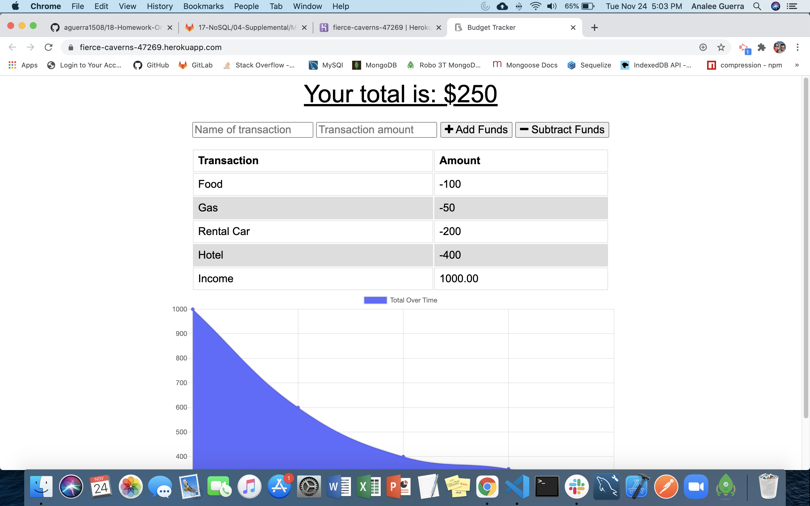
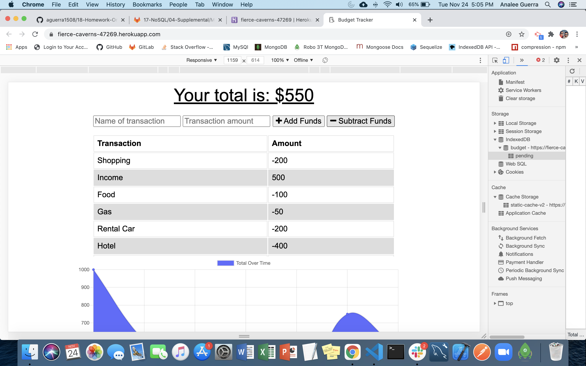
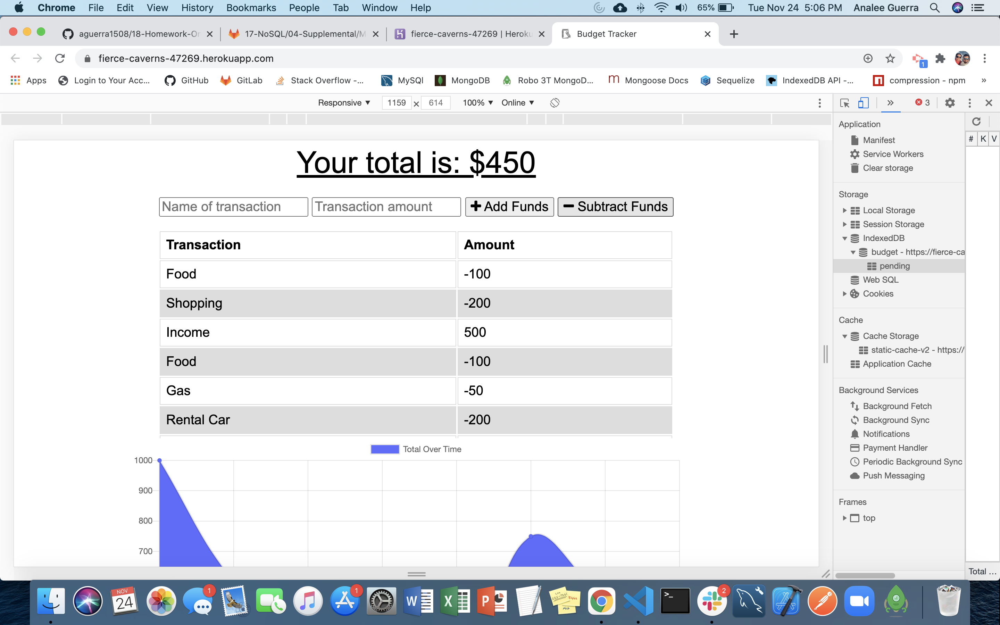
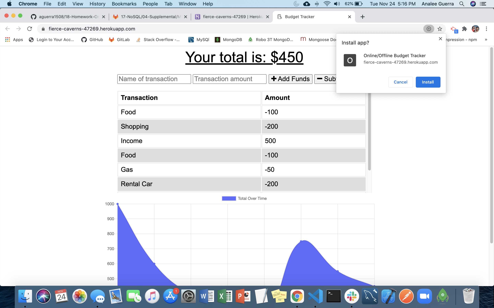

# Analee Guerra's Homework 18 - Online/Offline Budget Tracker

## Description

An application in which a user is able to add expenses and deposits to their budget with or without an internet connection. Transactions (both deposits and expenses) may be made when offline and once the user is back online, the budget will update accordingly.

## Table of Contents

- [Description](#description)
- [Installation](#installation)
- [Usage](#usage)
- [Credits](#credits)
- [License](#license)
- [Badges](#badges)
- [Contributing](#contributing)
- [Tests](#tests)
- [Questions](#questions)

## Installation

The application is deployed via Heroku and may be accessed via the following link: [Online/Offline Budget Tracker](https://fierce-caverns-47269.herokuapp.com/ "Budget App")

The application may also be installed as a PWA. Users can follow the instructions below, according to their device/ web browser.

**For iPhone users:**

1. Navigate to https://fierce-caverns-47269.herokuapp.com with Safari.
2. Tap the Share button in Safari.
3. Tap the icon labeled Add to Home Screen.
4. Tap Add in the upper-right corner.
5. Name your PWA, then tap Add in the upper-right corner.

**For Android users:**

1. Navigate to https://fierce-caverns-47269.herokuapp.com with Chrome.
2. Tap the menu button in the upper right corner of Chrome.
3. Tap the icon labeled Add to Home Screen.
4. Name your PWA, then tap Add below the promp.

To run the application locally, Visual Studio (VS) code and a web browser such as Google Chrome, are needed.

To run the application via VS code, the user must have installed and have MongoDB running. In a new terminal, the user must run the following command: `npm install` to install the necessary `node modules` and `package-lock.json`. Once the installs are complete, the application may be run via the following command: `node server.js` or `npm run start`.

## Usage

Online Use:

Offline Use:

Returning to Online Use:

PWA Installation:

## Credits

[Node JS](https://nodejs.org/en/ "Node JS")

[Express JS](https://expressjs.com/ "Express JS")

[MongoDB](https://docs.mongodb.com/manual/ "MongoDB")

[Mongoose JS](https://mongoosejs.com/docs/guide.html "Mongoose JS")

[MongoDB Atlas](https://www.mongodb.com/cloud/atlas "Mongo DB Atlas")

[Heroku](https://devcenter.heroku.com/ "Heroku")

## License

None

## Badges

## Contributing

None

## Tests

None

## Questions

**Git Hub:** [aguerra1508](https://github.com/aguerra1508 "Git Hub")

**For questions or comments, email me at:** aguerra1508@gmail.com
